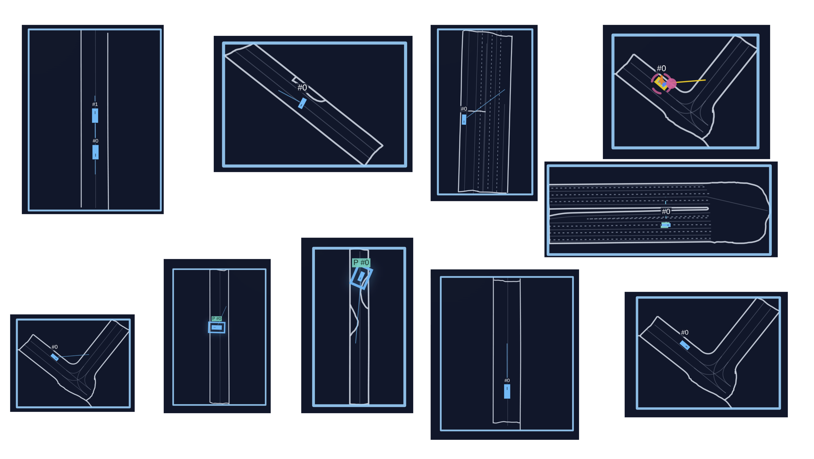

# Evaluations and benchmarks

Driving is a safety-critical multi-agent application, making careful evaluation and risk assessment essential. Mistakes in the real world are costly, so simulations are used to catch errors before deployment. To support rapid iteration, evaluations should ideally run efficiently. This is why we also paid attention to optimizing the speed of the evaluations. This page contains an overview of the available benchmarks and evals.

## Evaluation during training

PufferDrive supports running evaluations automatically during training. There are four evaluation types that can run periodically:

| Eval type | What it does | CLI flag to enable | Interval flag |
|---|---|---|---|
| **Render** | Records top-down and agent-view videos | `--train.render True` | `--train.render-interval N` |
| **Safe eval render** | Records videos with safe reward conditioning | `--safe-eval.enabled True` | `--safe-eval.interval N` |
| **Safe eval metrics** | Runs policy in subprocess, logs driving metrics | `--safe-eval.enabled True` | `--safe-eval.interval N` |
| **WOSAC realism** | Measures distributional realism (WOSAC benchmark) | `--eval.wosac-realism-eval True` | `--eval.eval-interval N` |
| **Human replay** | Tests policy alongside replayed human trajectories | `--eval.human-replay-eval True` | `--eval.eval-interval N` |

All eval types trigger at `epoch % interval == 0`. They require a saved checkpoint, so **`checkpoint-interval` must be <= the smallest eval interval**.

### Example: enable all evals

```bash
puffer train puffer_drive \
  --wandb --wandb-project pufferdrive \
  --train.checkpoint-interval 250 \
  --train.render True --train.render-interval 250 \
  --safe-eval.enabled True --safe-eval.interval 250 \
  --eval.wosac-realism-eval True \
  --eval.human-replay-eval True \
  --eval.eval-interval 250
```

### Safe eval

Safe eval measures how well the policy drives when given "safe" reward conditioning values (high penalties for collisions and offroad driving, rewards for lane keeping). It runs in a **separate subprocess** that loads the latest checkpoint, creates a fresh environment, and collects metrics over multiple episodes.

The safe eval subprocess inherits the training environment configuration (map directory, reward bounds, etc.) but overrides a few parameters:

- `num_agents`: Number of agents in the eval environment (default: 64)
- `episode_length`: How long each eval episode runs (default: 1000 steps)
- `num_episodes`: How many episode completions to collect before reporting (default: 100)
- `resample_frequency`: Automatically set to 0 (disabled) so episodes can run to completion

Metrics logged to wandb under `eval/*`:

- `eval/score`, `eval/collision_rate`, `eval/offroad_rate`
- `eval/completion_rate`, `eval/dnf_rate`
- `eval/episode_length`, `eval/episode_return`
- `eval/lane_alignment_rate`, `eval/lane_center_rate`
- And more (see `drive.h` `Log` struct for the full list)

Configure safe eval reward conditioning in `drive.ini` under `[safe_eval]`:

```ini
[safe_eval]
enabled = True
interval = 250
num_agents = 64
num_episodes = 100
episode_length = 1000

; Fixed reward conditioning values (min=max pins the value)
collision = -3.0
offroad = -3.0
overspeed = -1.0
traffic_light = -1.0
lane_align = 0.025
velocity = 0.005
```

### Async vs sync evaluation

By default, WOSAC and human replay evals run synchronously, blocking training until they finish. Set `--eval.eval-async True` to run them in background threads instead.

> **Note:** Render and safe eval always run synchronously in the training loop. The `eval_async` flag only affects WOSAC and human replay evaluations.

## Sanity maps

Quickly test the training on curated, lightweight scenarios without downloading the full dataset. Each sanity map tests a specific behavior.

```bash
puffer sanity puffer_drive --wandb --wandb-name sanity-demo --sanity-maps forward_goal_in_front s_curve
```

Or run them all at once:

```bash
puffer sanity puffer_drive --wandb --wandb-name sanity-all
```

- Tip: turn learning-rate annealing off for these short runs (`--train.anneal_lr False`) to keep the sanity checks from decaying the optimizer mid-run.

Available maps:

- `forward_goal_in_front`: Straight approach to a goal in view.
- `reverse_goal_behind`: Backward start with a behind-the-ego goal.
- `two_agent_forward_goal_in_front`: Two agents advancing to forward goals.
- `two_agent_reverse_goal_behind`: Two agents reversing to rear goals.
- `simple_turn`: Single, gentle turn to a nearby goal.
- `s_curve`: S-shaped path with alternating curvature.
- `u_turn`: U-shaped turn to a goal behind the start.
- `one_or_two_point_turn`: Tight turn requiring a small reversal.
- `three_or_four_point_turn`: Even tighter turn needing multiple reversals.
- `goal_out_of_sight`: Goal starts without direct path; needs some planning.



## Distributional realism benchmark (WOSAC)

We provide a PufferDrive implementation of the Waymo Open Sim Agents Challenge (WOSAC) for fast, easy evaluation of how well your trained agent matches distributional properties of human behavior.

```bash
puffer eval puffer_drive --eval.wosac-realism-eval True
```

Add `--load-model-path <path_to_checkpoint>.pt` to score a trained policy, instead of a random baseline.

See [the WOSAC benchmark page](wosac.md) for the metric pipeline and all the details.

## Human-compatibility benchmark

You may be interested in how compatible your agent is with human partners. For this purpose, we support an eval where your policy only controls the self-driving car (SDC). The rest of the agents in the scene are stepped using the logs. While it is not a perfect eval since the human partners here are static, it will still give you a sense of how closely aligned your agent's behavior is to how people drive. You can run it like this:

```bash
puffer eval puffer_drive --eval.human-replay-eval True --load-model-path <path_to_checkpoint>.pt
```

During this evaluation the self-driving car (SDC) is controlled by your policy while other agents replay log trajectories.
