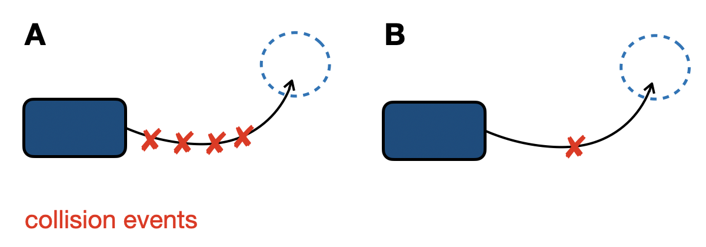
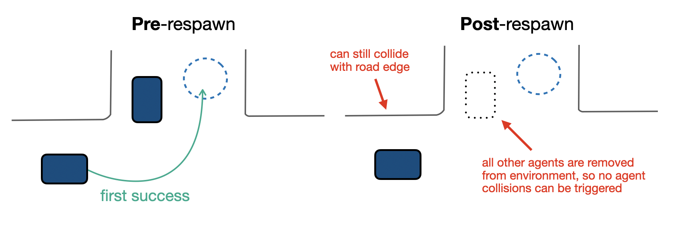
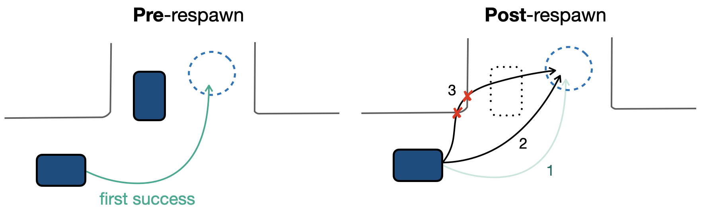

# PufferDrive

This readme contains several important assumptions and definions about the `PufferDrive` environment.

## Agent initialization and control

### `init_mode`

Determines which agents are **created** in the environment.

| Option                   | Description                                                                  |
| ------------------------ | ---------------------------------------------------------------------------- |
| `create_all_valid`       | Create all entities valid at initialization (`traj_valid[init_steps] == 1`). |
| `create_only_controlled` | Create only those agents that are controlled by the policy.                  |

### `control_mode`

Determines which created agents are **controlled** by the policy.

| Option                                    | Description                                                                                       |
| ----------------------------------------- | ------------------------------------------------------------------------------------------------- |
| `control_vehicles` (default)              | Control only valid **vehicles** (not experts, beyond `MIN_DISTANCE_TO_GOAL`, under `MAX_AGENTS`). |
| `control_agents`                          | Control all valid **agent types** (vehicles, cyclists, pedestrians).                              |
| `control_wosac` *(WOMD only)* | Control all agents with their valid flag to `True` at the `init_step`.                                        |


## Termination conditions (`done`)

Episodes are never truncated before reaching `episode_len`. The `goal_behavior` argument controls agent behavior after reaching a goal early:

* **`goal_behavior=0` (default):** Agents respawn at their initial position after reaching their goal (last valid log position).
* **`goal_behavior=1`:** Agents receive new goals indefinitely after reaching each goal.
* **`goal_behavior=2`:** Agents stop after reaching their goal.

## Logged performance metrics

We record multiple performance metrics during training, aggregated over all *active agents* (alive and controlled). Key metrics include:

- `score`: Goals reached cleanly (goal was achieved without collision or going off-road)
- `collision_rate`: Binary flag (0 or 1) if agent hit another vehicle.
- `offroad_rate`: Binary flag (0 or 1) if agent left road bounds.
- `completion_rate`: Whether the agent reached its goal in this episode (even if it collided or went off-road).


### Metric aggregation

The `num_agents` parameter in `drive.ini` defines the total number of agents used to collect experience.
At runtime, **Puffer** uses `num_maps` to create enough environments to populate the buffer with `num_agents`, distributing them evenly across `num_envs`.

Because agents are respawned immediately after reaching their goal, they remain active throughout the episode.

At the end of each episode (i.e., when `timestep == TRAJECTORY_LENGTH`), metrics are logged once via:

```C
if (env->timestep == TRAJECTORY_LENGTH) {
    add_log(env);
    c_reset(env);
    return;
}
```

Metrics are normalized and aggregated in `vec_log` (`pufferlib/ocean/env_binding.h`). They are averaged over all active agents across all environments. For example, the aggregated collision rate is computed as:

$$
r^{agg}_{\text{collision}} = \frac{\mathbb{I}[\text{collided in episode}]}{N}
$$

where $N$ is the number of controlled agents.
This value represents the fraction of agents that collided at least once during the episode. So, cases **A** and **B** below would yield identical off-road and collision rates:



Since these metrics do not capture *multiple* events per agent, we additionally log the **average number of collision and off-road events per episode**. This is computed as:

$$
c^{avg}_{\text{collision}} = \frac{\text{total number of collision events across all agents and environments}}{N}
$$

where $N$ is the total number of controlled agents.
For example, an `avg_collisions_per_agent` value of 4 indicates that, on average, each agent collides four times per episode.

### Effect of respawning on metrics

By default, agents are reset to their initial position when they reach their goal before the episode ends. Upon respawn, `respawn_timestep` is updated from `-1` to the current step index.

This raises the question: **how does repeated respawning affect aggregated metrics?**

To begin, note that the environment is a bit different before and after respawn. After an agent respawns, all other agents are "removed" from the environment. As a result, collisions with other agents cannot occur post-respawn.

This effectively transforms the scenario into a single-agent environment, simplifying the task since the agent no longer needs to coordinate with others.



#### `score`

Consider an episode of 91 steps where an agent is initialized relatively close to the goal position and reaches its goal three times:

1. **First attempt:** reaches the goal without collisions
2. **Second attempt:** reaches the goal without collisions
3. **Third attempt:** reaches the goal but goes off-road along the way



The highlighted trajectory shows the first attempt. In this case, the recorded score is `0.0` — a single off-road event invalidates the score for the entire episode. This behavior is desired: the score metric is unforgiving.

#### `offroad_rate` and `collision_rate`

Same logic holds as above.
