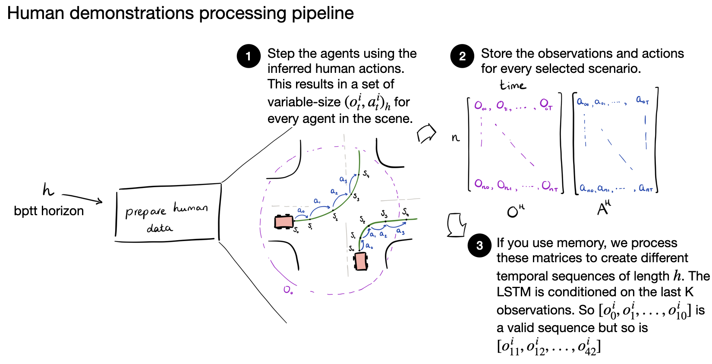

# Guided self-play from human demonstrations

Everything you need to know about data-regularized self-play in your experiments.

## Overview

The human regularization loss constrains the learned policy to stay close to expert demonstrations by maximizing the likelihood of human actions given the corresponding human observations.

## Loss Functions

### Human Regularization Loss

The human regularization loss is defined as the average negative log-likelihood of human actions:

$$
\mathcal{L}_{\text{human}} = -\frac{1}{B_{\text{human}}} \sum_{i=1}^{B_{\text{human}}} \log \pi_\theta(a_i^{\text{human}} \mid o_i^{\text{human}})
$$

where:
- $B_{\text{human}}$ is the batch size of human demonstrations
- $\pi_\theta$ is the policy being trained
- $a_i^{\text{human}}$ is the human action for sample $i$
- $o_i^{\text{human}}$ is the observation for sample $i$

**Intuition**: This loss encourages the policy to assign high probability to actions that humans took in similar situations. By minimizing the negative log-likelihood, we maximize the probability that the policy reproduces human behavior.

### Full Training Objective

The complete loss combines RL objectives with human regularization:

$$
\mathcal{L}_{\text{total}} = \mathcal{L}_{\text{PPO}} + \lambda_v \mathcal{L}_{\text{value}} - \lambda_e \mathcal{L}_{\text{entropy}} - \lambda_h \mathcal{L}_{\text{human}}
$$

where:
- $\mathcal{L}_{\text{PPO}}$ — clipped policy gradient loss (drives RL performance)
- $\mathcal{L}_{\text{value}}$ — value function loss (improves value estimation)
- $\mathcal{L}_{\text{entropy}}$ — entropy bonus (encourages exploration)
- $\lambda_h$ — weight for human regularization (controlled by `human_ll_coef`)

**How regularization works**:
- **Without regularization** ($\lambda_h = 0$): Policy optimizes purely for reward
- **With regularization** ($\lambda_h > 0$): Policy balances maximizing reward while staying close to human demonstrations

## Creating Dataset



**One-off step**. When you launch a run with `prepare_human_data=True`:

1. Collect dataset of $(o, a)$ pairs (in `c_collect_expert_data()`)
2. Process demonstrations as individual observation-action pairs

> Note: Currently only works with the classic dynamics model.

## Sampling Data During Training

During training, we sample a batch from the human demonstration dataset:
```python
discrete_human_actions, continuous_human_actions, human_observations = (
    self.vecenv.driver_env.sample_human_demonstrations()
)

human_logits, _ = self.policy(human_observations, human_state)

_, human_log_prob, human_entropy = pufferlib.pytorch.sample_logits(
    logits=human_logits, action=human_actions
)
```

The `human_log_prob` values compute $\log \pi_\theta(a_i^{\text{human}} \mid o_i^{\text{human}})$, which are averaged and negated to get $\mathcal{L}_{\text{human}}$.

## Configuration

- `human_ll_coef` sets $\lambda_h$, the weight of the human regularization term
- Typical range: 0.01 to 1.0, depending on demonstration quality
- Set to 0 to disable regularization
