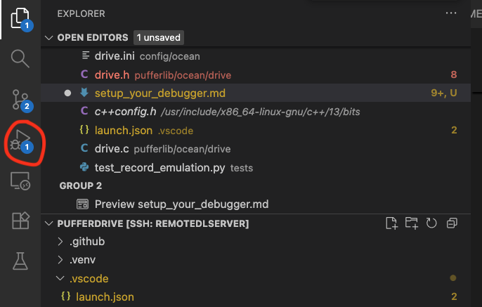
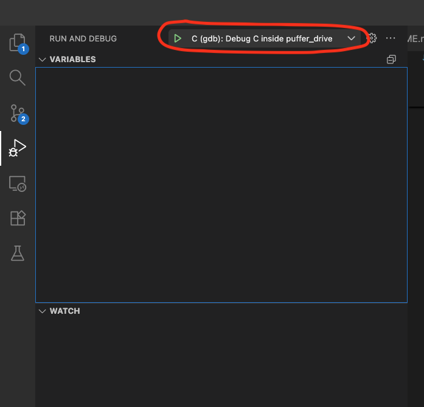
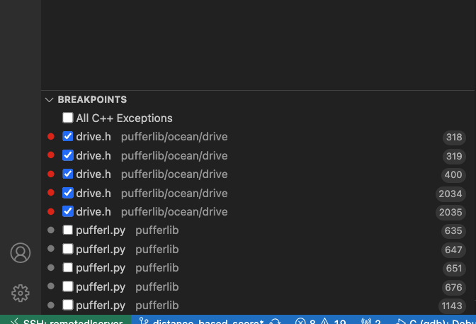
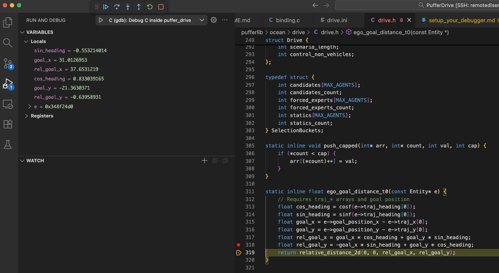

# Setting Up a C/Python Debugger for PufferAI

Debuggers are extremely useful tools. They let you step through code
instruction by instruction and observe how variables change over time.
This makes it much easier to understand confusing parts of the codebase
and avoids relying solely on your internal "world model" of what the
code *should* do. Debuggers also eliminate the need for excessive
`print` statements, which are tedious to manage and clean up afterward.

If you want a general introduction to debuggers, I recommend watching a
beginner-friendly [vscode debugger tutorial video](https://www.youtube.com/watch?v=3HiLLByBWkg) on YouTube.

> **Disclaimer:**\
> This guide was written by a beginner who tried this setup and
> succeeded. If you know better methods or improvements, please feel
> free to contribute!

------------------------------------------------------------------------

## Overview

Setting up a Python debugger is straightforward, and plenty of guides
exist online.\
However, debugging a Python application that spawns **multiple C/C++
threads**, such as PufferAI environments, requires a bit more care.

This guide is for **Unix-based systems (e.g., Ubuntu)** using
**VSCode**, which seems to be the default in the lab.

At a high level, our goal is to:

1. Install the tools needed to trace C/C++ code.
2. Set up VSCode to launch Python under `gdb`.
3. Tell VSCode which Python module to run.
4. Configure `gdb` to follow the child C++ processes spawned by Python.

------------------------------------------------------------------------

## 1. Install `gdb`

We'll start by installing the GNU Debugger:

``` bash
sudo apt update && sudo apt install -y gdb
which gdb       # expect: /usr/bin/gdb
gdb --version
```

------------------------------------------------------------------------

## 2. Configure VSCode

Inside your **PufferDrive** directory, create a `.vscode` folder:

``` bash
mkdir PufferDrive/.vscode
```

Now create a file called **`launch.json`** with the following content:

``` jsonc
{
  "configurations": [
    // --- Python debugger only ---
    {
      "name": "Python: Debug puffer train puffer_drive",
      "type": "python",
      "request": "launch",
      "module": "pufferlib.pufferl",
      "args": ["train", "puffer_drive"],
      "cwd": "${workspaceFolder}",
      "python": "/home/ricky/git/PufferDrive/.venv/bin/python", // <- TODO: point to your python interpreter
      "justMyCode": false,
      "env": {
        "PYTHONPATH": "${workspaceFolder}"
      }
    },

    // --- Python running under gdb (C/C++ breakpoints work) ---
    {
      "name": "C (gdb): Debug C inside puffer_drive",
      "type": "cppdbg",
      "request": "launch",
      "program": "/home/ricky/git/PufferDrive/.venv/bin/python", // <- TODO: point to your python interpreter
      "args": ["-m", "pufferlib.pufferl", "train", "puffer_drive"],
      "cwd": "${workspaceFolder}",
      "MIMode": "gdb",

      "miDebuggerPath": "/usr/bin/gdb",  // <- TODO: point to your gdb path (see previous step to check the path)

      "externalConsole": false,
      "stopAtEntry": false,
      "env": { "PYTHONPATH": "${workspaceFolder}" },

      "setupCommands": [
        { "text": "set breakpoint pending on" },
        { "text": "set follow-fork-mode child" }
      ]
    }
  ]
}
```

**Notes**

-  The first configuration is the standard Python debugger.
-  The second runs Python **inside `gdb`**, enabling C/C++
    breakpoints.
-  The `"follow-fork-mode child"` line is crucial---PufferAI
    environments spawn child processes that must be traced.

------------------------------------------------------------------------

## 3. Using the Debugger

### Setting Breakpoints

Open the C/C++ file you want to inspect in VSCode.\
Click to the left of any line to place a breakpoint (a red dot).\
VSCode will pause execution when that line is reached.

### Opening the Debug Panel

Open the debugger sidebar in VSCode:



### Selecting the Debugger Configuration

Use the dropdown to select: **"C (gdb): Debug C inside puffer_drive"**



At the lower left, you should now see your list of breakpoints.\
You can check/uncheck each one to enable or disable it:



### Example Debugger Output

Here is an example of what a debug session may look like:



- The yellow arrow around the red dot on the left of the code editor highlights the point at which the code paused.
- On the top left you have a "Variables" tab that allows you to explore all existing variables and their values.
- Underneath, the "Watch" section lets you write simple code expression that manipulate the existing variables and print the output.

For more information on how to then move forward to the next breakpoint, step only the next code instruction etc. I refer you to the [vscode debugger tutorial video](https://www.youtube.com/watch?v=3HiLLByBWkg).
