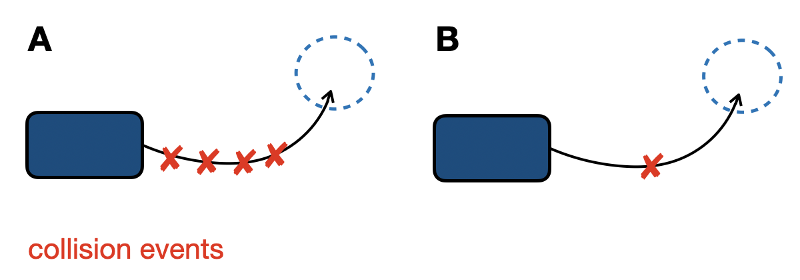
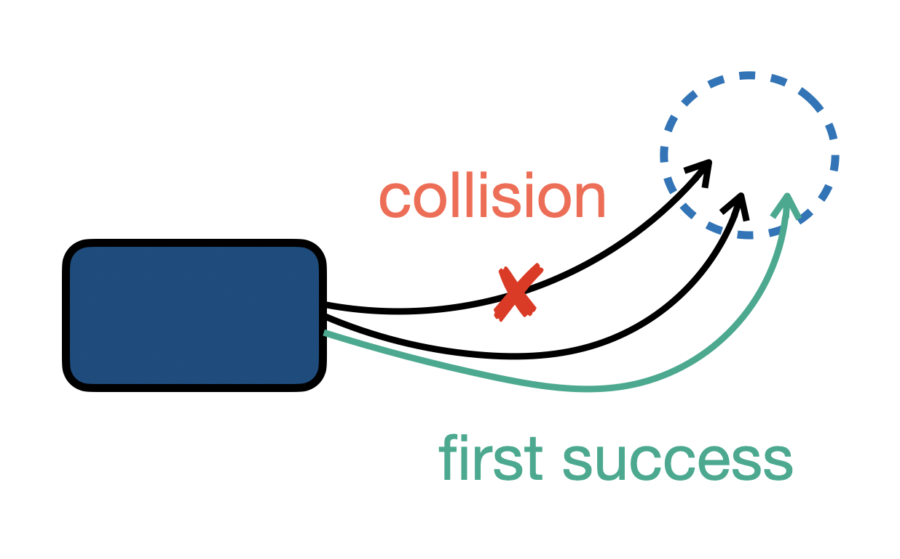

# PufferDrive

This readme contains several important assumptions and definions about the `PufferDrive` environment.

## Assumptions for initializating agents

### Waymo Open Motion Dataset (WOMD)

By default, the environment only creates and controls **vehicles** that meet the following conditions:

- Their `valid` flag is `True` at initialization (as determined by `init_steps`).
- Their initial position is more than `MIN_DISTANCE_TO_GOAL` away from the goal.
- They are **not** marked as experts in the scenario file.
- The total number of agents has **not** yet reached `MAX_AGENTS`.

When `control_non_vehicles=True`, these same conditions apply, but the environment will also include **non-vehicle agents**, such as cyclists and pedestrians.

## Termination conditions (`done`)

Episodes are never truncated before reaching `episode_len`. The `use_goal_generation` argument controls agent behavior after reaching a goal early:

* **`use_goal_generation=False` (default):** Agents respawn at their initial position after reaching their goal (last valid log position).
* **`use_goal_generation=True`:** Agents receive new goals indefinitely after reaching each goal.

## Logged performance metrics

We record multiple performance metrics during training, aggregated over all *active agents* (alive and controlled). Since agents are respawned upon reaching their goal by default (see section above), and many agents in the Waymo Open Dataset (WOMD) are initialized near their goals, metrics are computed **only for each agent’s first attempt** at completing the scene to ensure an unbiased performance estimate.

- `score`: Goals reached cleanly (goal was achieved without collision or going off-road)
- `collision_rate`: Binary flag (0 or 1) if agent hit another vehicle.
- `offroad_rate`: Binary flag (0 or 1) if agent left road bounds.
- `completion_rate`: Did the agent reach the goal this episode (even if it collided or went off-road)?


### Metric aggregation

The `num_agents` parameter in `drive.ini` defines the total number of agents used to collect experience.
At runtime, **Puffer** uses `num_maps` to create enough environments to populate the buffer with `num_agents`, distributing them evenly across `num_envs`.

Because agents are respawned immediately after reaching their goal, they remain active throughout the episode.

At the end of each episode (i.e., when `timestep == TRAJECTORY_LENGTH`), metrics are logged once via:

```C
if (env->timestep == TRAJECTORY_LENGTH) {
    add_log(env);
    c_reset(env);
    return;
}
```

Metrics are normalized and aggregated in `vec_log` (`pufferlib/ocean/env_binding.h`). They are averaged over all active agents across all environments. For example, the aggregated collision rate is computed as:

$$
r^{agg}_{\text{collision}} = \frac{\mathbb{I}[\text{collided in episode}]}{N}
$$

where $N$ is the number of controlled agents.
This value represents the fraction of agents that collided at least once during the episode.

As a result, cases **A** and **B** below would yield identical off-road and collision rates:



Since these metrics do not capture *multiple* events per agent, we also log the total number of collision and off-road events per episode across all agents.

### Remark 1: Effect of Respawning on Metrics

By default, agents are reset to their initial position when they reach their goal before the episode ends. Upon respawn, `respawn_timestep` is updated from `-1` to the current step index.

This raises the question: **how does repeated respawning affect aggregated metrics?**

#### `score`

Consider an episode of 91 steps where an agent is initialized relatively close to the goal position and reaches its goal three times:

1. **First attempt:** reaches the goal without collision
2. **Second attempt:** reaches the goal without collision
3. **Third attempt:** reaches the goal but collides along the way



The highlighted trajectory shows the first attempt. In this case, the recorded score is `0.0` — a single collision invalidates the score for the entire episode.

This behavior is desired: the score metric is unforgiving.

#### `offroad_rate` and `collision_rate`

Same logic holds as above.

### Remark 2: Effect of respawning on learning

Agents receive different goal rewards depending on whether the goal is reached before or after a respawn.

The default settings in `drive.ini` are:
```
reward_goal = 1.0
reward_goal_post_respawn = 0.25
```

This logic is implemented here:

```C
if (distance_to_goal < env->goal_radius) {
    if (env->entities[agent_idx].respawn_timestep != -1) {
        env->rewards[i] += env->reward_goal_post_respawn;
        env->logs[i].episode_return += env->reward_goal_post_respawn;
    } else {
        env->rewards[i] += env->reward_goal;
        env->logs[i].episode_return += env->reward_goal;
        env->entities[agent_idx].sampled_new_goal = 1;
        env->logs[i].num_goals_reached += 1;
    }
}
```

I think this introduces stochasticity that the agent cannot observe: it has no notion of which attempt it is on. For consistency, I think it is better to use a single unified goal reward.


### Remark 3: Inconsistency Between `metrics_array` and `offroad_rate` Variables

This issue is not harmful at the moment but worth noting for future dev.

There are currently two separate systems for tracking collisions, which are slightly inconsistent:

* **`env->logs[i].collision_rate` / `offroad_rate` (in `Log` struct)**

  * Actively used to track collisions and off-road events
  * Set to `1.0` when such events occur
  * Used in aggregation and reporting

* **`metrics_array[COLLISION_IDX]` / `[OFFROAD_IDX]` (in `Entity` struct)**

  * Reset to `0` on respawn
  * Never updated to non-zero values anywhere in the code
  * Never actually used in aggregation or logging
